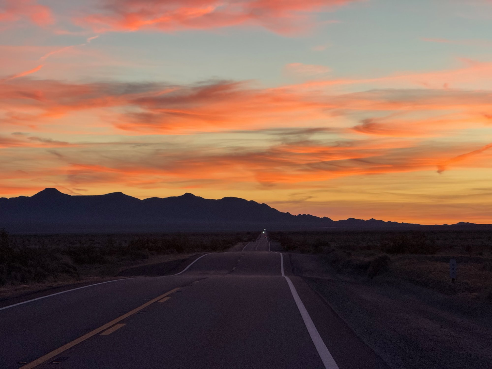
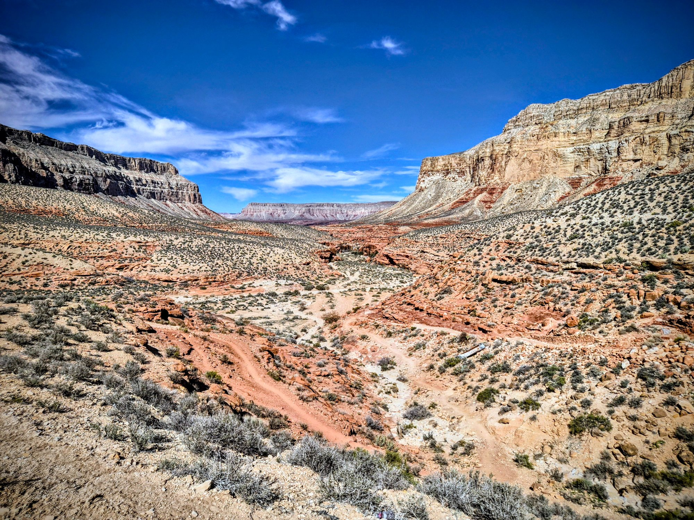
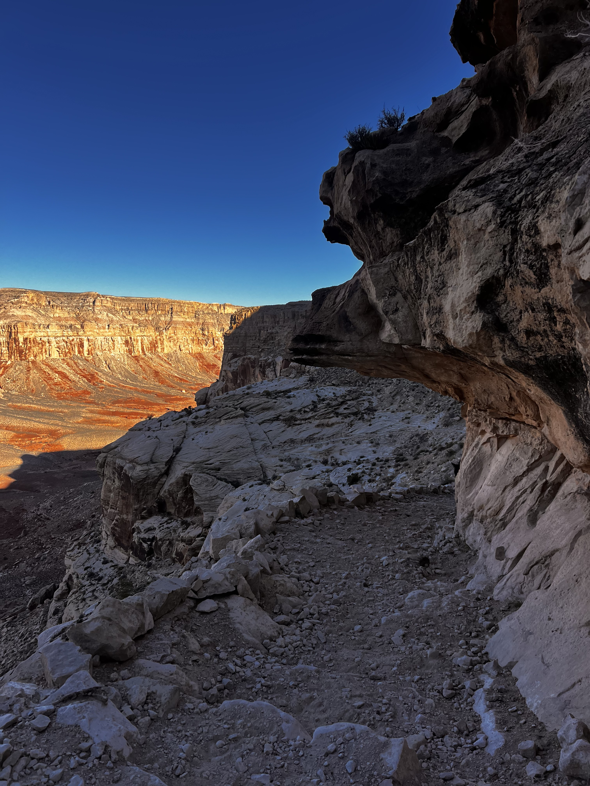
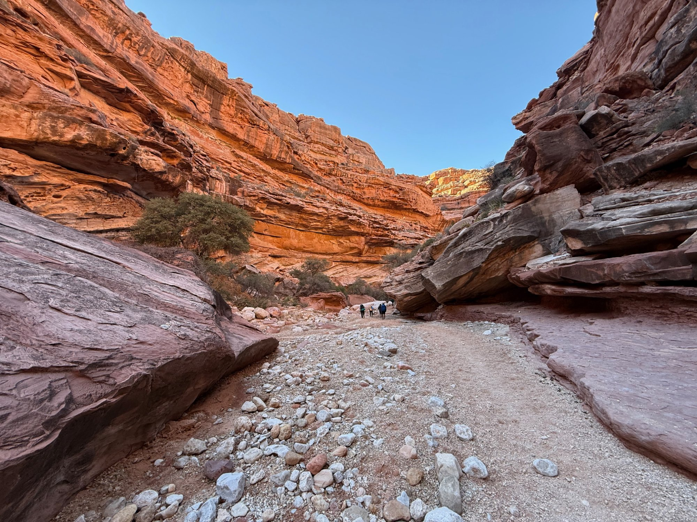
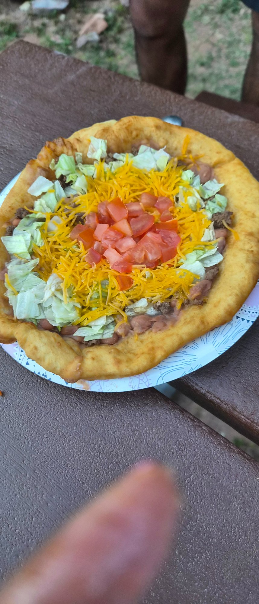
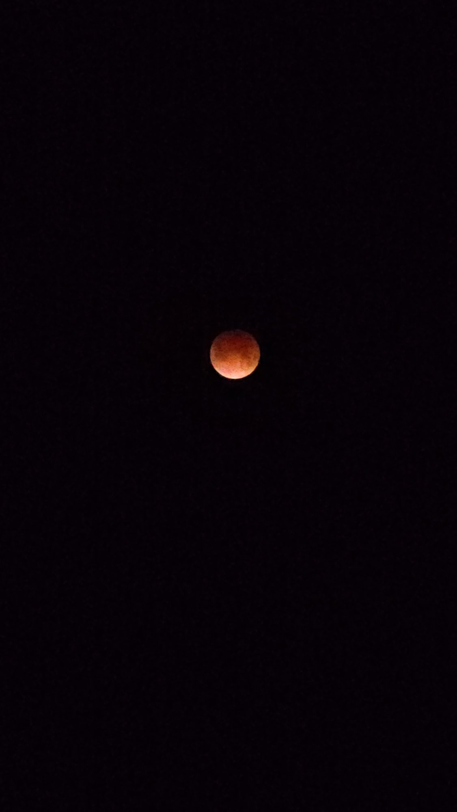
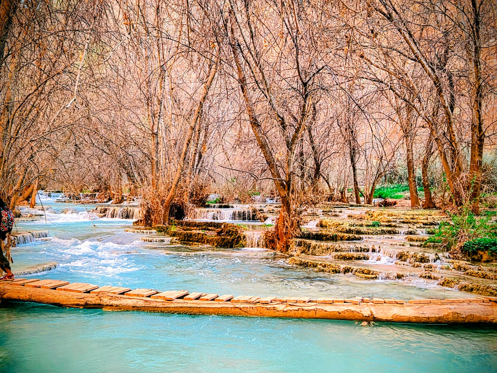
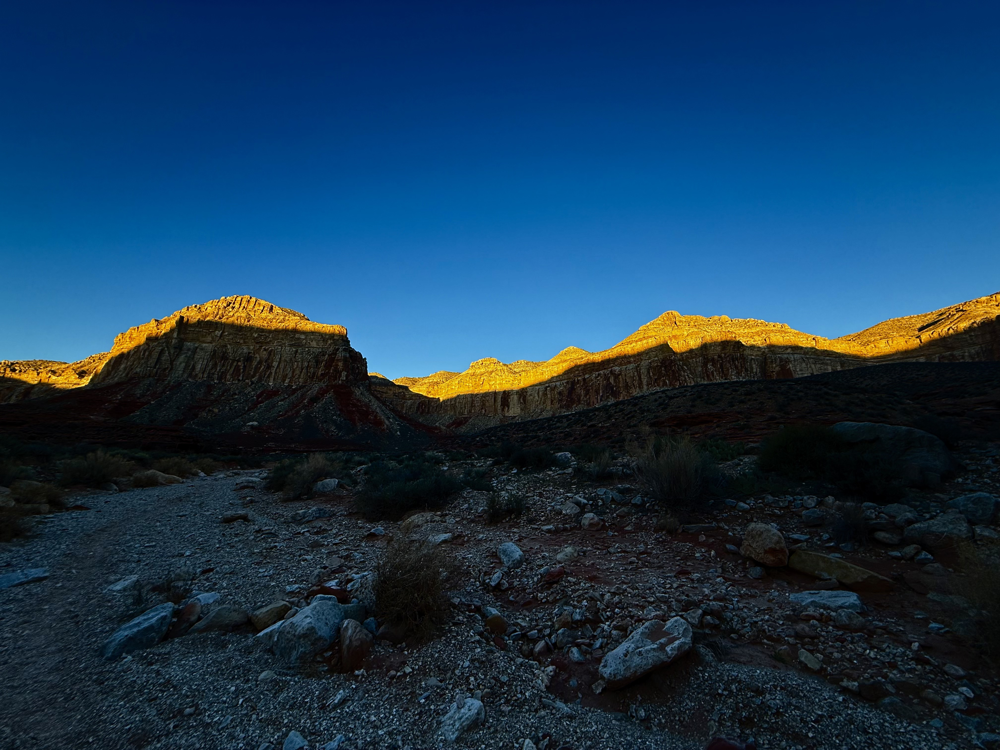
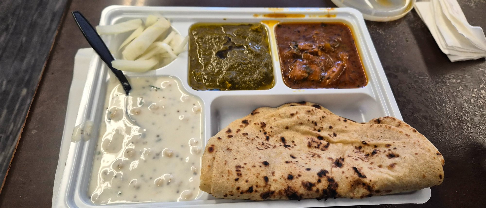

```{r setup, include=FALSE}
knitr::opts_chunk$set(echo = FALSE, warning = FALSE, message = FALSE)
library(tufte)
```

```{css, echo=FALSE}
.box-teal {
  background-color: #e8f7f5;
  border-left: 4px solid #2a9d8f;
  padding: 0.9em 1.2em;
  margin: 1.2em 0;
  border-radius: 4px;
}
.box-amber {
  background-color: #fdf6e3;
  border-left: 4px solid #e9a825;
  padding: 0.9em 1.2em;
  margin: 1.2em 0;
  border-radius: 4px;
}
.box-red {
  background-color: #fdecea;
  border-left: 4px solid #c0392b;
  padding: 0.9em 1.2em;
  margin: 1.2em 0;
  border-radius: 4px;
}
.box-blue {
  background-color: #eaf3fb;
  border-left: 4px solid #2980b9;
  padding: 0.9em 1.2em;
  margin: 1.2em 0;
  border-radius: 4px;
}
.box-grey {
  background-color: #f4f4f4;
  border-left: 4px solid #888;
  padding: 0.9em 1.2em;
  margin: 1.2em 0;
  border-radius: 4px;
  font-style: italic;
}
/* Closing paragraph */
.closing-para {
  font-family: Georgia, 'Times New Roman', serif;
  font-style: italic;
  color: #4a4a4a;
  font-size: 1.05em;
  line-height: 1.8;
  margin-top: 1.5em;
  border-top: 1px solid #ccc;
  padding-top: 1em;
}
body div.box-teal, body div.box-amber, body div.box-red,
body div.box-blue, body div.box-grey {
  width: 55%;
}
body div.closing-para {
  width: 100vw;
  position: relative;
  left: 50%;
  right: 50%;
  margin-left: -50vw;
  margin-right: -50vw;
  padding: 1.2em 4em;
  box-sizing: border-box;
}
```


There are images that lodge. That find a soft place in the mind and press themselves in, gently, firmly, without drama. This one had blue green water. Unreal, almost impossible blue green water, pooled against walls of deep red stone. It came from somewhere called Havasupai. A word that meant, in the language of the people who had lived there for eight hundred years, the people of the blue green water. Of course it did. Some places name themselves exactly right.

Havasupai permits are notoriously hard to get. They open once a year, sell out within hours, and for a group of twelve the odds are not flattering. We got ours on the first try, which felt less like a reward for planning and more like the universe deciding to cooperate on a particular day in early 2026. We were lucky and everyone unanimously braced the permit fortune. 

`r margin_note("<em>Havasu Falls: red canyon walls, electric turquoise pool, deep blue sky. No filter, no exaggeration.</em>")`

---

# Background: Who Are the Havasupai?

The real reading, the history and context, happened after coming back. It made the experience sit differently in retrospect.

`r newthought("It is worth knowing a little")` about the people whose land you're visiting. The Havasupai, known as *Havsuw Baaja* ("the people of the blue-green water"), have lived in and around Havasu Canyon for at least 800 years. The canyon and the plateau above it were one continuous world to them, used seasonally across millions of acres. That world had survived two waves of colonial contact before the federal government got around to drawing a reservation boundary around it.

`r margin_note("**Havasupai Basics** <br> Located within the Grand Canyon, Coconino County, AZ. The tribe has lived here for at least 800 years. Supai Village is the only U.S. settlement not accessible by road; mail still comes by mule. Current tribal population: ~700–800 people. The creek's name, *Havasu*, means 'blue-green water'.")`

In 1882 the federal government reduced the Havasupai's world to just **518 acres**, the canyon floor only, with everything above the rim absorbed into federal reserves and eventually, in 1919, Grand Canyon National Park. The tribal population fell sharply. Children were sent to boarding schools and punished for speaking their language.

`r margin_note("The 1848 handover came via the Mexican-American War, a conflict that Congressman Abraham Lincoln publicly challenged and Ulysses S. Grant later called 'one of the most unjust wars ever waged by a stronger nation against a weaker one.' President Polk sent troops into disputed territory between the Rio Grande and the Nueces River, Mexico responded, and Polk declared American blood had been shed on American soil. The resulting Treaty of Guadalupe Hidalgo transferred present-day California, Arizona, New Mexico, Nevada, Utah, and parts of Colorado and Wyoming (about 525,000 square miles) to the US for $15 million. The Havasupai, who had no say in any of it, simply found themselves under a different government.")`

`r margin_note("Both the Spanish and the Americans caused profound harm to the native peoples of the Southwest, through different means. Spanish colonizers brought the mission system, which was essentially forced religious conversion and forced labour, and introduced diseases to which indigenous populations had zero immunity. Smallpox, measles, and influenza killed between 50 and 90 percent of some native communities before a single American settler arrived. American settlers and the US government then continued the destruction through land seizures backed by federal law, military campaigns, the deliberate extermination of the buffalo herds that plains tribes depended on for survival, and the boarding school system that forcibly removed children from their families and punished them for speaking their own languages. The Havasupai experienced both waves. Their canyon isolation offered partial protection from disease but no protection from the 1882 reservation order that reduced their world to 518 acres. Neither chapter in this history has a more innocent actor than the other.")`

`r margin_note("The same country that spent the 20th century lecturing the world about sovereignty and the sanctity of borders acquired half a continent by starting a war over a boundary line it drew itself.")`

`r margin_note("Grand Canyon National Park was established in 1919 on lands the Havasupai had used for centuries. For decades, the park's existence and the tribe's dispossession were rarely discussed together. They still often aren't.")`

The turning point came in **January 1975**, when President Gerald Ford signed the [**Grand Canyon National Park Enlargement Act**](https://www.congress.gov/bill/93rd-congress/senate-bill/1296), which expanded the reservation from 518 acres to roughly 188,000 acres, designated an additional 95,300 acres as permanent Havasupai Use Lands, and provided a $1.25 million settlement for nearly a century of dispossession. Senator Barry Goldwater, who had become an advocate for the tribe, remarked upon passage: *"After 95 years, they've got their homeland back."* It was an incomplete restoration. Language loss, disrupted traditions, and generational trauma do not get fixed by legislation. But it was real, and it mattered.

Today the [Havasupai Tribe](https://www.havasupaitribe.com) manages the reservation, runs the permit system, operates the campground and lodge, and controls access to what has become one of the most in-demand wilderness permits in the United States. Permits are booked at [havasupaireservations.com](https://www.havasupaireservations.com). That last part would have been unimaginable in 1960. It is, in its own way, a kind of justice.

---

# The Geography: A Canyon Inside a Canyon

`r newthought("Havasu Canyon is a side canyon")` of the Grand Canyon, carved by Havasu Creek on its way to join the Colorado River about twelve miles downstream. From the trailhead at Hualapai Hilltop, you would never guess any of it exists. The desert is dry in every direction. The canyon only reveals itself when you walk into it.

The trail drops about 2,000 feet over eleven miles. The first mile is pure switchbacks carved into the canyon wall. After that the walls close in, the grade levels off, and you walk a sandy wash with red and cream-colored sandstone walls rising on both sides. The geology reads like a stack of geological time periods: Kaibab limestone at the rim, Coconino sandstone through the middle miles, Hermit Shale in deep reds as you approach the canyon floor.

`r margin_note("**The main waterfalls** <br> 1. **Navajo Falls**: reshaped by 2008 flooding; wide and braided <br> 2. **Fifty Foot Falls**: broad ledge, best from a distance <br> 3. **Havasu Falls**: the iconic ~100 ft plunge into turquoise <br> 4. **Mooney Falls**: tallest at ~200 ft; chains and tunnels to the base <br> 5. **Beaver Falls**: 3 miles past the lodge; terraced pools, almost no crowds <br> 6. **Confluence Falls**: where Havasu Creek meets the Colorado River, another ~4 miles past Beaver Falls. We did not make it. Next time.")`

<div class="box-teal">
The water's color deserves its own explanation because it genuinely does not look real. Havasu Creek is extremely high in calcium carbonate and magnesium, dissolved from the limestone it flows through. As the water aerates over falls and rapids, those minerals precipitate out as **travertine**, the porous stone that forms the terraced pools throughout the canyon. The interaction of light with that mineral suspension is what produces the turquoise color. It shifts from almost neon in direct sunlight to a deep teal in shade. No filter required, though you will be tempted to apply one anyway out of sheer disbelief.
</div>

`r margin_note("I had confidently told at least two people before the trip that the blue colour was caused by phosphates in the water. It is not. It is calcium carbonate and magnesium. The phosphate theory was entirely my own invention and I retract it fully.")`

The travertine is actively growing. The pools and their retaining walls are getting imperceptibly larger every year. The canyon is still being built.

---

# The Trip: Day by Day

## Day 0: Friday Night / Saturday Morning, Feb 28

`r newthought("We were twelve,")` friends from San Diego, six men and six women who called themselves the Trailblazers, in a rented 12-seater van. Departure was scheduled for 1 a.m. Anyone who has ever tried to move twelve people at 1 in the morning will not be surprised that we left closer to 1:30.

`r margin_note("<em>Crossing into Arizona at sunrise. The Grand Canyon State made a first impression before we had even had coffee.</em>")`

The drive from San Diego to the Hualapai Hilltop trailhead runs through the Mojave, past Kingman, and then south on Route 66 before turning off onto Indian Route 18 for the last 65 miles. It is a long drive through genuinely empty country, and the van made it feel like a moving slumber party, with some people sleeping, some talking, and the odd song playing here and there.

`r margin_note("<em>A freight train cuts across a carpet of yellow wildflowers along Route 66. The Mojave in rare bloom, spotted from the van window on the drive out.</em>")`

Somewhere on Route 66, the desert lit up. The sunrise caught us mid-drive and the whole group stirred, and we pulled over for an impromptu photo session, the highway stretching out in both directions with nobody else in sight, the sky doing everything it could with orange and pink. It was the first reminder that this trip was going to deliver well before we even reached the canyon.

```{r route66-sunset, fig.cap="The Route 66 sunrise that stopped the van. The desert sky was doing its best work at the California-Arizona border. We did not plan this. The highway just decided to put on a show.", out.width="100%"}

```


`r margin_note("**Logistics at a glance** <br> Departed San Diego: 1 a.m., Feb 28 <br> Breakfast: Mr D'z Diner, Kingman <br> Permit pickup: Havasupai Tourism Office, Peach Springs <br> Trailhead departure: 12:30 p.m. <br> Arrived Supai Village: ~6 p.m. <br> Trail distance to lodge one way: ~11 miles <br> Elevation loss: ~2,000 ft")`

`r margin_note("<em>Mr D'z Route 66 Diner in Kingman. The vintage truck out front sets expectations correctly.</em>")`

We stopped for breakfast at [Mr D'z Diner](https://www.mrdz66diner.com) in Kingman first, a Route 66 institution with chrome stools and the kind of breakfast plate that makes a 1 a.m. departure feel entirely worth it. Then we made our way to the Havasupai Tourism Office in Peach Springs to pick up our permits, a required in-person stop before you can legally enter the reservation. By 12:30 p.m. we were at the trailhead, packs on, and beginning the descent.

```{r plateau-view, fig.cap="One mile in from the trailhead. The plateau stretches in every direction.", out.width="100%", fig.fullwidth=TRUE}

```

## Day 1: The Hike In

```{r canyon-reveal, fig.margin=TRUE, fig.cap="The canyon reveals itself. That first look over the rim before the descent. Nothing in the flat desert above prepares you for what is down there.", out.width="100%"}

```

At the trailhead I got talking with one of the tribal employees, a friendly, sharp-witted man. He was generous with information: great weather ahead, he said, and the color of the water right now was as good as it gets. He also taught me a handful of phrases in Supai, the tribal language. [*Gam'yu*](https://www.bigorrin.org/havasupai_kids.htm) ("gahm-yoo") is a friendly greeting, and the one I am most confident I have spelled correctly. He also shared rough equivalents of thank you and how are you, which I attempted to repeat with varying degrees of accuracy ; also credit to his considerable patience and visible amusement.

That encounter set the tone for the people we met throughout the trip. Without exception, everyone we came across in and around the village was warm, grounded, and easy to talk to. And somewhat unexpectedly to those of us who had not thought it through, everyone spoke fluent English. The tribe has been navigating the outside world for a long time, and it shows.

The first mile of the trail is a series of switchbacks that take you off the rim and into the canyon proper. It sounds straightforward and it is, but there is something about that first plunge into the Grand Canyon, with the walls rising around you and the desert disappearing overhead, that makes you feel like you have crossed into a different set of physical rules. The scale of the place takes a while to register.

After the switchbacks the canyon floor levels out and the trail becomes a long, easy walk between narrowing walls. The red and cream sandstone is everywhere. The light in the canyon changes character as the walls get taller; it becomes more directional, more dramatic, without you quite being able to say why. It is a very good place to walk with a group of friends. Conversations got long.

```{r canyon-trail, fig.cap="The Trailblazers in the canyon, the walls rising on both sides and the group tiny against the scale of it. This is what the middle miles of the hike feel like.", out.width="100%"}

```

`r margin_note("Havasu Creek first appears a couple of miles from Supai Village: a sudden turquoise ribbon in a red canyon. Most of the Trailblazers stopped walking without any prior coordination when they first saw it.")`

Havasu Creek appears a couple of miles before the village, and yes, it really does look like that. The water is genuinely clear and almost pristine as seein images of a Caribbean lagoon, running between canyon walls of deep red sandstone. `r margin_note("<em>The village at dusk, with the canyon walls catching the last light and the moon already up. The quiet here is a different quality of quiet.</em>")`

We arrived at Supai Village around 6 p.m., checked into the lodge, ate a simple dinner, and called it a night. The village is very quiet after dark. That first night's sleep, after a 1 a.m. departure and a long hike, was exceptional.

## Day 2: The Falls Day

`r margin_note("<em>Navajo Falls: the terraced travertine pools stepping down through the orange rock. Reshaped entirely by the 2008 flood, it is still extraordinary.</em>")`

`r newthought("This was the day everyone had come for.")` We started at Havasu Falls, which is everything the photographs suggest and then a little more. The falls drop roughly 100 feet over a travertine lip into a wide pool that is, without exaggeration, that turquoise. We took approximately four hundred photographs of the same waterfall from slightly different angles, and eventually convinced ourselves to move on.

`r margin_note("<em>Havasu Falls from the side. Small caves are visible in the travertine wall to the left, kept permanently dark and damp by the mist.</em>")`

`r margin_note("<video width='100%' controls playsinline style='border-radius:4px;'><source src='videos/canyon.mp4' type='video/mp4'></video><em>The canyon in motion. No photograph quite captures what it feels like to be standing in it.</em>")`

Mooney Falls is about a mile further downstream and a completely different experience. At 200 feet it is taller than Havasu, but what makes it memorable is the route to the bottom. You descend through two short tunnels drilled through the travertine cliff, then onto a near-vertical face using iron stakes and chains hammered into the rock. The rock is wet from the constant mist. It is not technical climbing, but it asks for your full attention, and the first time you look down at the pool two hundred feet below while gripping a chain, you understand exactly why this waterfall is [named after a man who died attempting to reach it](https://en.wikipedia.org/wiki/Mooney_Falls).

```{r mooney-falls, fig.cap="Mooney Falls at 200 feet, the tallest in the canyon, photographed from the base after the chain descent. The scale of the drop only becomes real once you are standing beneath it.", out.width="100%"}
knitr::include_graphics("images/mooney_falls.jpg")
```

`r margin_note("<video width='100%' controls playsinline style='border-radius:4px;'><source src='videos/mooney_falls.mp4' type='video/mp4'></video><em>Mooney Falls in motion. The roar at the base is something no photograph can communicate.</em>")`

`r margin_note("Mooney Falls is named for D.W. 'James' Mooney, a prospector who fell to his death attempting to descend the cliff in 1880. The chains-and-tunnels route was subsequently cut by miners. The descent remains the most committing part of any standard Havasupai itinerary.")`

The pool at the base of Mooney is enormous and extremely cold and absolutely worth it. I swam into it, toward the falls, and the water there is a different beast entirely. The turbulence from a 200-foot drop is something else; the waves push you around and the cold hits immediately. Whether it was actually colder than Havasu or just felt that way is hard to say. My best guess is that Mooney was marginally colder, but the difference was close enough that I would not argue the point. We ate there on snacks and food packed in from the lodge, lounging on the travertine in the mist and spray. A good portion of the group just stayed in the water.

`r margin_note("<em>A makeshift log bridge over Havasu Creek, one of the improvised crossings on the way to Beaver Falls. The water is that colour in real life.</em>")`

Beaver Falls is another three miles downstream and involves around eleven creek crossings in total, four of them substantial and the rest smaller but no less beautiful, sections of boulder-hopping, and stretches where you simply wade the creek because the trail has merged with it. We did all of this. Beaver Falls itself is not one dramatic plunge but a series of terraced cascades stepping down through travertine shelves into pools of varying shades of green. The water crossings on the way there were some of the most fun of the whole trip: clear, cold water, moving fast enough to feel it, the canyon walls high on both sides. By the time we reached Beaver Falls there was almost no one else around.

Beyond Beaver Falls, another four miles or so downstream, Havasu Creek meets the Colorado River at what is known as Confluence Falls. We did not get there, as time and legs both had their limits, but it is on the list for a return trip.

```{r beaver-creek, fig.cap="The creek near Beaver Falls. Crystal clear water threads through red canyon walls in one of the most serene stretches of the entire trip.", out.width="100%"}
knitr::include_graphics("images/IMG_0732.JPG")
```

We made it back to the village by evening, put together a light dinner, played cards, and slept well.

`r margin_note("<em>Havasu Creek winding through cottonwoods near the village lodge. The turquoise against the red sandstone and bare winter trees is a colour combination that has no business existing in a desert.</em>")`

`r margin_note("<video width='100%' controls playsinline style='border-radius:4px;'><source src='videos/creek_view.mp4' type='video/mp4'></video><em>The creek in motion. The stillness of the canyon makes the sound of moving water carry a long way.</em>")`

## Day 3: Fifty Foot Falls and a Long Afternoon at Havasu

`r newthought("Day three had a slower rhythm to it,")` which felt right. We hiked to Fifty Foot Falls in the morning, a wide ledge waterfall better appreciated from a viewing distance than up close, honestly, but worth the walk. Then we spent most of the rest of the day back at Havasu Falls, which did not get any less beautiful the second time. This was the day I actually got in, properly in and swimming toward the falls. The water pushes back hard. The waves from the impact are choppier than they look from the bank. Cold, turbulent, and absolutely worth every second of it.

`r margin_note("<video width='100%' controls playsinline style='border-radius:4px;'><source src='videos/fifty_foot_falls.mp4' type='video/mp4'></video><em>Fifty Foot Falls in motion. The sound and flow convey something a still frame cannot.</em>")`

This was the day for actually absorbing the place rather than moving through it. People swam, people napped on the warm travertine, people sat with their feet in the water and stared at the canyon walls. There was no agenda. It was a very good afternoon.

On the way back through the village we stopped for fry bread from one of the Havasupai tribal members selling it near the village center. After three days of trail food and snacks, warm fry bread tasted extraordinary. We went back for seconds.

```{r frybread, fig.margin=TRUE, fig.cap="Indian Taco: fry bread piled with beans, ground beef, shredded cheese, lettuce, and fresh tomato. A Havasupai staple and one of the highlights of Day 3.", out.width="100%"}

```

That evening at the lodge involved a long session of Impostor that, as these games tend to, revealed unexpected sides of people's personalities. The accusations were spirited. No one admitted to anything.

## Day 4: Blood Moon, Sunrise, and a Punjabi Dhaba

`r newthought("We set our alarms for 4 a.m.")` on the last morning because of a lunar eclipse. A [blood moon](https://en.wikipedia.org/wiki/Lunar_eclipse#Blood_moon), a total lunar eclipse where the moon turns a deep coppery red as it moves through Earth's shadow, was happening in the pre-dawn hours of March 3rd. If you want to find a place with no light pollution, no cell towers, and an unobstructed view of open sky, the bottom of the Grand Canyon at 4 a.m. is an excellent option.

```{r bloodmoon, fig.cap="The blood moon of March 3, 2025, photographed from the canyon floor at 4 a.m. Zero light pollution, total silence, and twelve Trailblazers staring up in the dark.", out.width="100%"}

```

The moon was enormous and rust-colored and completely silent above the canyon walls. Twelve Trailblazers stood in the dark and looked at it without saying much. It was one of those things that is just better when you happen to be in the right place at the right time with people you love.

`r margin_note("A blood moon occurs when the moon passes completely into Earth's umbral shadow. Sunlight scattered through the atmosphere bends onto the lunar surface, giving it the red colour. Watching one from the floor of the Grand Canyon, with zero light pollution, was not something we planned around. It just happened.")`

We started the hike out around sunrise. Eight miles of ascent through a Grand Canyon morning, the walls shifting colour as the light changed, the canyon floor still in shadow while the rim above was already gold. It was a genuinely beautiful walk and a good way to end the trip. Nobody complained about the climb, which is either a testament to the group's fitness or to the fact that no one wanted to be the first to say anything.

```{r creek-terraces, fig.cap="One of the stream crossings that stayed with us long after the trip. The travertine terraces, the bare cottonwoods, the water stepping down in shades of turquoise and white. Some places refuse to leave you alone. — <span style='color:#8b1a1a;'>ഈ വർണ്ണസുരഭിയാം ഭൂമിയിലല്ലാതെ കാമുകഹൃദയങ്ങളുണ്ടോ? സന്ധ്യകളുണ്ടോ ചന്ദ്രികയുണ്ടോ ഗന്ധർവഗീതമുണ്ടോ?</span> ([Vayalar Ramavarma](https://en.wikipedia.org/wiki/Vayalar_Ramavarma) — [♪](https://www.youtube.com/watch?v=LX_pS9RPpH8)) — On what world but this, this earth of color and fragrance, do loving hearts beat? Where else do twilights fall, moonlight drift across the night, and the unseen songs of Gandharvas float through the air?", out.width="100%"}

```

```{r morning-hike, fig.cap="The early morning ascent, with first light catching the canyon walls as the Trailblazers made their way back up. That golden hour in the Grand Canyon is something else entirely.", out.width="100%", fig.fullwidth=TRUE}

```

The van was where we had left it at the trailhead. Everyone changed into dry clothes, loaded up, and headed out.

```{r dhaba, fig.margin=TRUE, fig.cap="The dhaba spread: saag, butter chicken, raita, raw onion, and a tandoori roti. Somewhere on an Arizona highway, completely unasked for and entirely perfect.", out.width="100%"}

```

`r margin_note("<em>Welcome back to California. The sign on the highway coming in from Arizona, spotted somewhere between the Dhaba and home.</em>")`

Somewhere on the drive back through Arizona, we stopped at [**Kohinoor Dhaba**](https://maps.google.com/?q=Kohinoor+Dhaba,+12470+Frontage+Rd,+Yucca,+AZ+86438), a Punjabi dhaba on Frontage Road in Yucca, AZ, that against all reasonable expectation was serving some of the finest Punjabi food any of us had eaten in the United States. 4.7 stars on Google with over 1,700 reviews, $10-20 a head, no reservations. The kind of place you would drive past a hundred times without stopping. We ordered too much, ate all of it, and were very happy. Then came the real entertainment: the drive back. The DJ rotation properly kicked in, with everyone throwing in their picks. I briefly had the aux and made full use of the opportunity, leaning hard into 80s and 90s classics: Bon Jovi, A-ha, Bryan Adams, Dire Straits, F.R. David, Phil Collins, Hotel California, Ricky Martin, a little Backstreet Boys for good measure, then AR Rahman, Bollywood favourites, and a run of Malayalam and Tamil hits that the Arizona highway had absolutely no idea what to do with. The kind of songs that have no business sounding as good as they do at full van volume. We made a quick stop at a Starbucks somewhere along the way, fuelled up on caffeine, and carried on. The drive back to San Diego was loud and warm and comfortable in the way that the end of a good trip with good people tends to be.

We pulled into San Diego around 7 p.m.

<div class="closing-para">
Some trips you enjoy in the moment and forget by the following week. This was not one of those trips. The canyon stays with you: in the colour of water you keep comparing things to, in the ache in your legs that lingers for days, and in the particular way a group of twelve people looks at each other when they know they have shared something that will not be easy to explain to anyone who was not there.
</div>

`r margin_note("**If you're planning to go** <br><br> **Permits.** Book at havasupaireservations.com. They open in early February and sell out within hours. For a large group, have multiple people trying at once. Check back for cancellations. <br><br> **The drive.** About 5–6 hours from San Diego. The last 65 miles on Indian Route 18 are remote. Fill up before you turn off Route 66. <br><br> **Start early.** We started at 12:30 p.m. and arrived near dark. A morning start is much smarter. <br><br> **Footwear.** Water shoes help but are not essential. Good trail shoes work fine for the creek crossings. <br><br> **Fry bread.** Do not skip it. <br><br> **Flash floods.** The canyon floods fast from storms you will never see. Follow the tribe's warnings. <br><br> **Pack out everything.** The rules are binding. Leave nothing.")`


# References & Further Reading

- [Havasupai Tribe Official Website](https://www.havasupaitribe.com)
- [Havasupai Permit Reservations](https://www.havasupaireservations.com)
- [Havasupai — Wikipedia](https://en.wikipedia.org/wiki/Havasupai)
- [Havasupai–Hualapai Language — Wikipedia](https://en.wikipedia.org/wiki/Havasupai%E2%80%93Hualapai_language)
- [Grand Canyon National Park Enlargement Act, 1975](https://www.congress.gov/bill/93rd-congress/senate-bill/1296)
- [Treaty of Guadalupe Hidalgo — Wikipedia](https://en.wikipedia.org/wiki/Treaty_of_Guadalupe_Hidalgo)
- [Mooney Falls — Wikipedia](https://en.wikipedia.org/wiki/Mooney_Falls)
- [Blood Moon / Lunar Eclipse — Wikipedia](https://en.wikipedia.org/wiki/Lunar_eclipse)
- [Mr D'z Diner, Kingman AZ](https://www.mrdz66diner.com)
- [Kohinoor Dhaba, Yucca AZ](https://maps.google.com/?q=Kohinoor+Dhaba,+12470+Frontage+Rd,+Yucca,+AZ+86438)

---


<div class="box-grey">
With thanks to the Havasupai Tribe for maintaining and opening access to this place, and to eleven Trailblazers, friends and family, who made the whole thing what it was.
</div>
