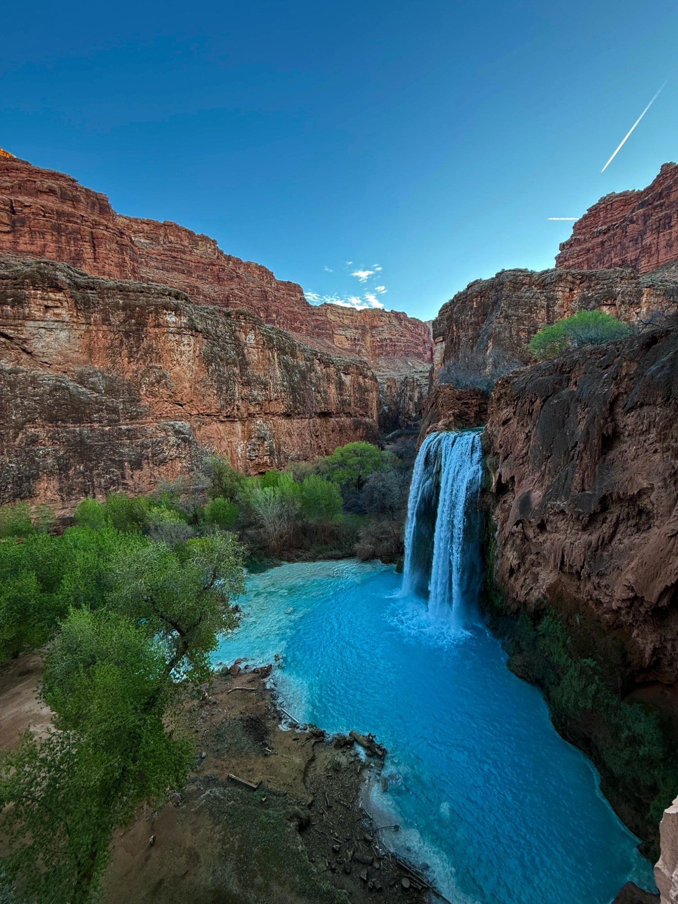
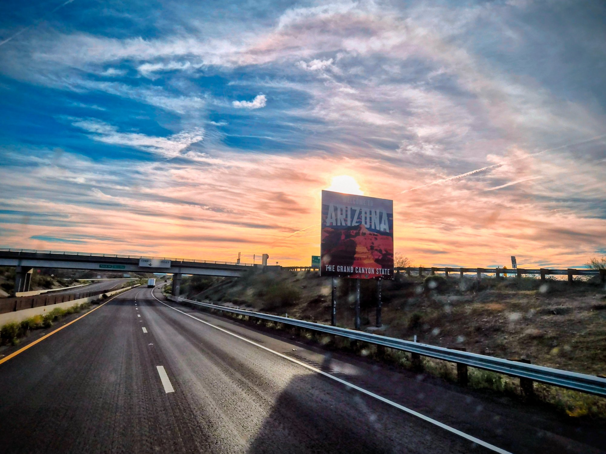
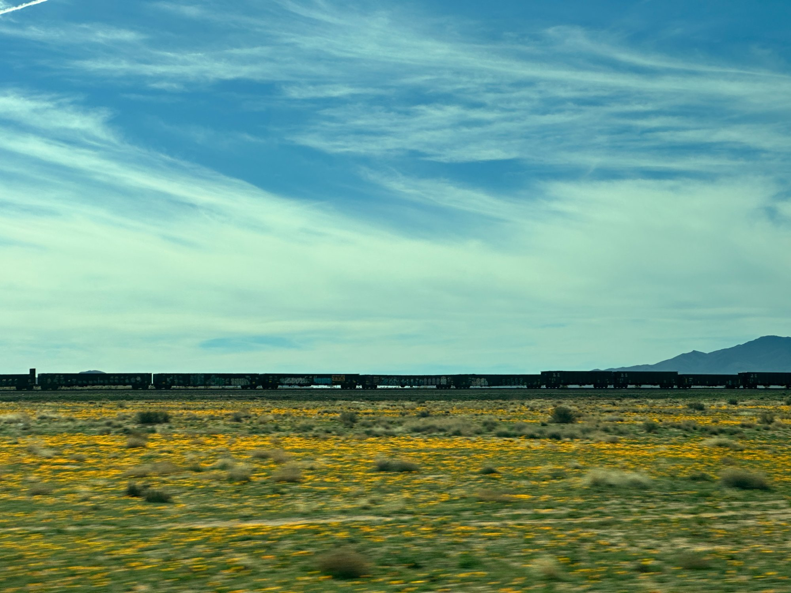
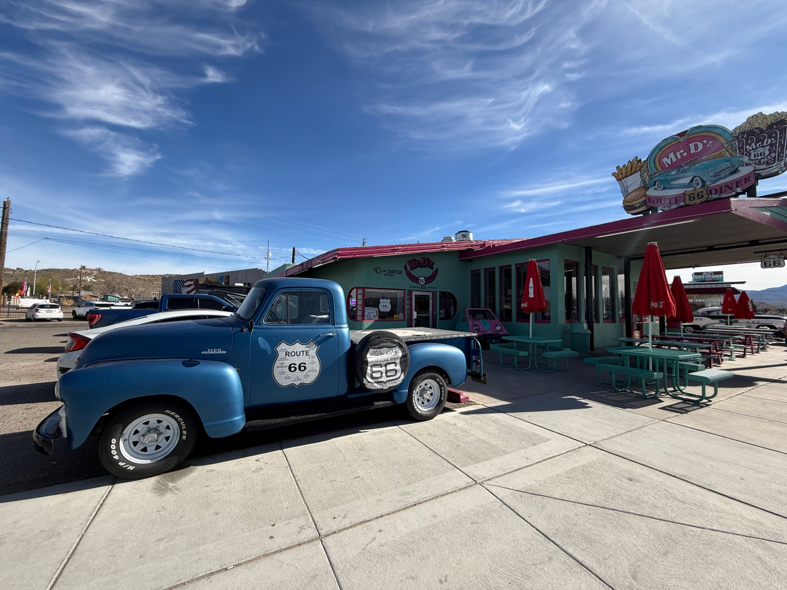
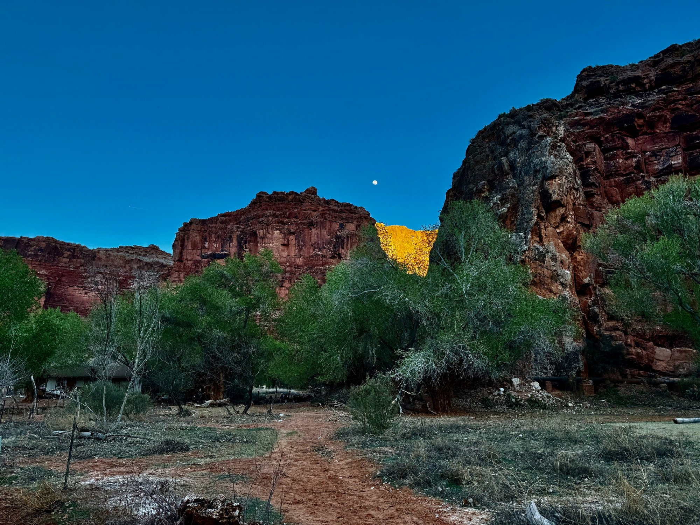
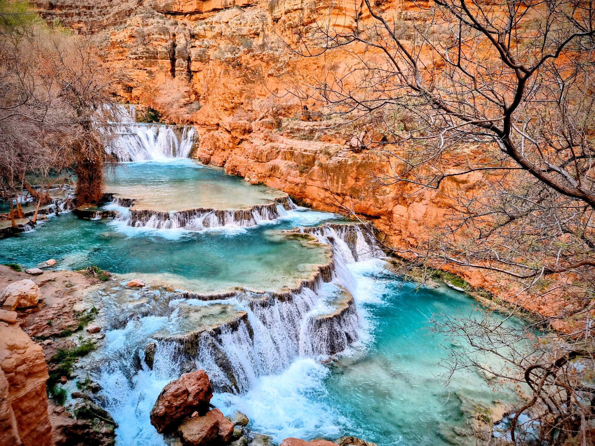
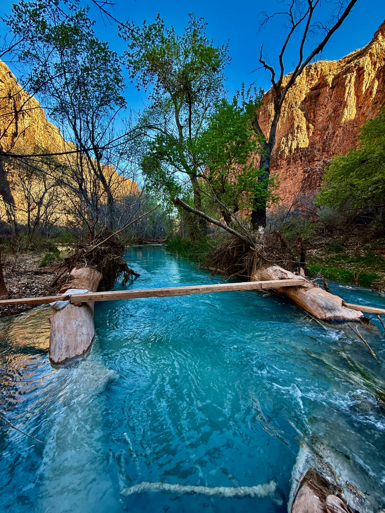
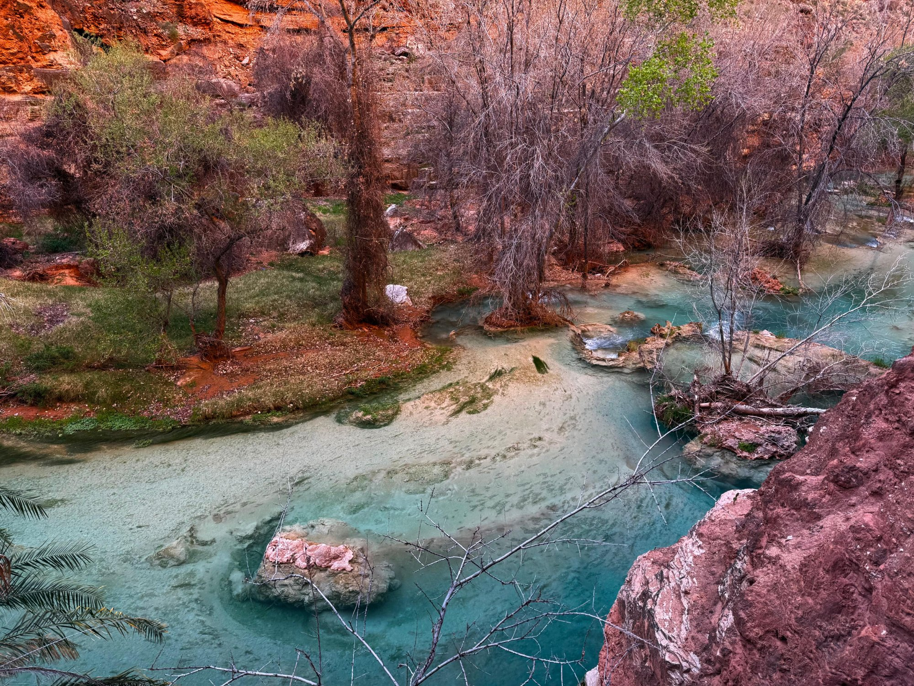

# Hiking to the Havasupai Waterfall
**Rethna Pulikkoonattu** | **March 2025**

---

Some images stay with you for no particular reason. Years ago I came across a photograph - blue-green water against deep red canyon walls - and it lodged somewhere in the back of the mind the way certain images do. Not an obsession, just a quiet recurring thought: *that place is real, and it would be something to see it.* Havasupai permits are notoriously hard to get. They open once a year, sell out within hours, and for a group of twelve the odds are not flattering. We got ours on the first try, which felt less like a reward for planning and more like the universe deciding to cooperate on a particular Tuesday morning in February. We were not going to argue with it.

---

## Background: Who Are the Havasupai?

A few blogs and YouTube videos were about the extent of the preparation before the trip. The real reading - the history, the geography, the context - happened after coming back. It turned out to be a fascinating rabbit hole, and it made the experience sit differently in retrospect. What follows is some of that.

It is worth knowing a little about the people whose land you're visiting - because Havasupai is not just a hiking destination. It is a homeland with a long and complicated history.

The Havasupai  -  *Havsuw Baaja*, "the people of the blue-green water"  -  have lived in and around Havasu Canyon for at least 800 years. Their traditional territory spanned roughly five million acres of plateau and canyon land in what is now northwestern Arizona. Summers were spent in the canyon, farming corn, beans, and squash along the creek. Winters were spent on the Coconino Plateau, hunting and gathering. The canyon and the plateau above it were one continuous world to them. That world had already survived two waves of colonial contact - first the Spanish, who reached the canyon in the 1500s, and then the Americans, who seized the Southwest from Mexico following the 1848 Treaty of Guadalupe Hidalgo - before the federal government got around to drawing a reservation boundary around it.

> **Havasupai Basics**
> - Located within the Grand Canyon, Coconino County, AZ
> - The tribe has lived here for at least 800 years
> - Supai Village is the only U.S. settlement not accessible by road  -  mail still comes by mule
> - Current tribal population: ~700–800 people
> - The creek's name, *Havasu*, means "blue-green water"

That world was substantially dismantled in 1882, when the federal government established a reservation for the tribe covering just **518 acres**  -  essentially only the narrow canyon floor. Everything above the rim, including the plateau lands the Havasupai had always used seasonally, was absorbed first into federal forest reserves and then, in 1919, into Grand Canyon National Park. For nearly a century, tribal members were barred from lands their grandparents had camped on freely, and for much of that period the National Park Service actively opposed any expansion of the reservation.

> **How did the Mexican-American War actually start?** The short answer is that President James K. Polk wanted the land and manufactured a justification. Texas had declared independence from Mexico in 1836 and been annexed by the US in 1845 - itself a deeply contested act Mexico never recognised. The two countries disagreed on where the Texas border actually sat: the US claimed the Rio Grande, Mexico claimed the Nueces River, roughly 150 miles further north. Polk sent troops into the disputed zone, Mexico responded militarily, and Polk went to Congress declaring that Mexico had "shed American blood on American soil." Congressman Abraham Lincoln publicly demanded Polk show exactly which spot of "American soil" he was referring to - and got no satisfying answer. Ulysses S. Grant, who fought in the war, later called it "one of the most unjust wars ever waged by a stronger nation against a weaker one." The 1848 Treaty of Guadalupe Hidalgo handed the US present-day California, Arizona, New Mexico, Nevada, Utah, and parts of Colorado and Wyoming - about 525,000 square miles - in exchange for $15 million. Mexico had little choice but to sign.

> **What did this mean for the people already living here?** Both the Spanish and the Americans caused profound harm to the native peoples of the Southwest, through different means. Spanish colonizers brought the mission system - forced religious conversion and forced labour - and introduced diseases to which indigenous populations had zero immunity. Smallpox, measles, and influenza killed between 50 and 90 percent of some native communities before a single American settler arrived. American settlers and the US government then continued the destruction through land seizures backed by federal law, military campaigns, the deliberate extermination of the buffalo herds that plains tribes depended on for survival, and the boarding school system that forcibly removed children from their families and punished them for speaking their own languages. The Havasupai experienced both waves. Their canyon isolation offered partial protection from disease but no protection from the 1882 reservation order that reduced their world to 518 acres. Neither chapter in this history has a more innocent actor than the other.

> The same country that spent the 20th century lecturing the world about sovereignty and the sanctity of borders acquired half a continent by starting a war over a boundary line it drew itself.

The tribal population fell to under 200 people by mid-century. Children were sent to boarding schools and punished for speaking their language. The situation was, by any measure, a quiet catastrophe unfolding inside one of the country's most celebrated landscapes.

> Grand Canyon National Park was established in 1919 on lands the Havasupai had used for centuries. For decades, the park's existence and the tribe's dispossession were rarely discussed together  -  they still often aren't.

The turning point came in **January 1975**, when President Gerald Ford signed the [**Grand Canyon National Park Enlargement Act**](https://www.congress.gov/bill/93rd-congress/senate-bill/1296). Buried in the legislation were provisions that:

- Expanded the Havasupai Reservation from 518 acres to roughly **188,000 acres**
- Designated an additional **95,300 acres** of federal land as permanent Havasupai Use Lands
- Provided a **$1.25 million settlement** for nearly a century of dispossession

Senator Barry Goldwater of Arizona, who had visited the tribe and become an advocate for their cause, remarked upon passage: *"After 95 years, they've got their homeland back."* It was an incomplete restoration  -  language loss, disrupted traditions, and generational trauma do not get fixed by legislation  -  but it was real, and it mattered.

Today the [Havasupai Tribe](https://www.havasupaitribe.com) manages the reservation, runs the permit system, operates the campground and lodge, and controls access to what has become one of the most in-demand wilderness permits in the United States. Permits are booked at [havasupaireservations.com](https://www.havasupaireservations.com). That last part would have been unimaginable in 1960. It is, in its own way, a kind of justice.

---

## The Geography: A Canyon Inside a Canyon

Havasu Canyon is a side canyon of the Grand Canyon, carved by Havasu Creek on its way to join the Colorado River about twelve miles downstream. From the trailhead at Hualapai Hilltop, you would never guess any of it exists  -  the desert is flat, dry, and unremarkable in every direction. The canyon only reveals itself when you walk to the rim and look over the edge.

The trail drops about 2,000 feet over eleven miles. The first mile is pure switchbacks carved into the canyon wall. After that the walls close in, the grade levels off, and you walk a sandy wash with red and cream-colored sandstone walls rising on both sides. The geology reads like a stack of time periods: Kaibab limestone at the rim, Coconino sandstone through the middle miles, Hermit Shale in deep reds as you approach the canyon floor.

> **The main waterfalls**
> 1. **Navajo Falls**  -  reshaped by flooding in 2008; wide and braided, great for a swim
> 2. **Fifty Foot Falls**  -  broad ledge waterfall, best viewed from a distance
> 3. **Havasu Falls**  -  the iconic one; ~100 ft plunge into a turquoise pool
> 4. **Mooney Falls**  -  the tallest at ~200 ft; accessed via chains and tunnels drilled into the cliff
> 5. **Beaver Falls**  -  3 miles past the lodge; terraced pools, almost no crowds
> 6. **Confluence Falls**  -  where Havasu Creek meets the Colorado River, ~4 miles past Beaver Falls. We did not make it. Next time.

The water's color deserves its own explanation because it genuinely does not look real. Havasu Creek is extremely high in calcium carbonate and magnesium, dissolved from the limestone it flows through. As the water aerates over falls and rapids, those minerals precipitate out as **travertine**  -  the porous stone that forms the terraced pools throughout the canyon. The interaction of light with that mineral suspension produces the turquoise color. It shifts from almost neon in direct sunlight to a deep teal in shade. No filter required, though you will be tempted to apply one anyway out of sheer disbelief.

> I had confidently told at least two people before the trip that the blue colour was caused by phosphates in the water. It is not. It is calcium carbonate and magnesium. The phosphate theory was entirely my own invention and I retract it fully.

The travertine is actively growing. The pools and their retaining walls are getting imperceptibly larger every year. The canyon is still being built.

---

## The Trip: Day by Day

### Day 0  -  Friday Night / Saturday Morning, Feb 28

We were twelve, friends from San Diego - six men, six women, self-styled the Trailblazers - in a rented 12-seater van. Departure was scheduled for 1 a.m. Anyone who has ever tried to move twelve people at 1 in the morning will not be surprised that we left closer to 1:30.

The drive from San Diego to the Hualapai Hilltop trailhead runs through the Mojave, past Kingman, and then south on Route 66 before turning off onto Indian Route 18 for the last 65 miles. It is a long drive through genuinely empty country, and the van made it feel like a moving slumber party  -  some people sleeping, some talking, the odd song playing here and there.

Somewhere on Route 66, the desert lit up. The sunrise caught us mid-drive and the whole group stirred - we pulled over for an impromptu photo session, the highway stretching out in both directions with nobody else in sight, the sky doing everything it could with orange and pink. It was the first reminder that this trip was going to deliver well before we even reached the canyon.

We stopped for breakfast at [Mr D'z Diner](https://www.mrdz66diner.com) in Kingman - a Route 66 institution, with the chrome stools and the neon sign and the kind of breakfast plate that makes a 1 a.m. departure feel entirely worth it. Fuelled up and in considerably better spirits, we carried on toward the trailhead.

> **Logistics at a glance**
> - Departed San Diego: 1 a.m., Feb 28
> - Breakfast: Mr D'z Diner, Kingman
> - Permit pickup: Havasupai Tourism Office, Peach Springs
> - Trailhead departure: 12:30 p.m.
> - Arrived Supai Village: ~6 p.m.
> - Trail distance to lodge one way: ~11 miles
> - Elevation loss: ~2,000 ft

We stopped for breakfast at Mr D'z Diner in Kingman first, then made our way to the Havasupai Tourism Office in Peach Springs to pick up our permits - a required in-person stop before you can legally enter the reservation. By 12:30 p.m. we were at the trailhead, packs on, and beginning the descent.

---

### Day 1  -  The Hike In

*The canyon reveals itself - that first look over the rim before the descent. Nothing in the flat desert above prepares you for what is down there.*

At the trailhead I got talking with one of the tribal employees - a friendly, sharp-witted man who seemed thoroughly entertained by twelve people from San Diego nervously adjusting their pack straps. He was generous with information: great weather ahead, he said, and the colour of the water right now was as good as it gets. He also taught me a handful of phrases in Supai, the tribal language - [*gam'yu*](https://www.bigorrin.org/havasupai_kids.htm) ("gahm-yoo", a friendly greeting) being the one I am most confident I have spelled correctly, along with rough attempts at thank you and how are you that I could not hope to transcribe - which I attempted to repeat with varying degrees of accuracy and which he received with considerable patience and visible amusement.

That encounter set the tone for the people we met throughout the trip. Without exception, everyone we came across in and around the village was warm, grounded, and easy to talk to. And somewhat unexpectedly to those of us who had not thought it through, everyone spoke fluent English - the tribe has been navigating the outside world for a long time, and it shows.

The first mile of the trail is a series of switchbacks that take you off the rim and into the canyon proper. It sounds straightforward and it is, but there is something about that first plunge into the Grand Canyon  -  the walls rising around you, the desert disappearing overhead  -  that makes you feel like you have crossed into a different set of physical rules. The scale of the place takes a while to register.

After the switchbacks the canyon floor levels out and the trail becomes a long, easy walk between narrowing walls. The red and cream sandstone is everywhere. The light in the canyon changes character as the walls get taller  -  it becomes more directional, more dramatic, without you quite being able to say why. It is a very good place to walk with a group of friends. Conversations got long.

Havasu Creek appears a couple of miles before the village  -  and yes, it really does look like that. The water is genuinely the color of a Caribbean lagoon, running between canyon walls of deep red sandstone. Most of the Trailblazers stopped walking without any prior coordination when they first saw it.

We arrived at Supai Village around 6 p.m., checked into the lodge, ate a simple dinner, and called it a night. The village is very quiet after dark. That first night's sleep, after a 1 a.m. departure and a long hike, was exceptional.

---

### Day 2  -  The Falls Day

This was the day everyone had come for. We started at Havasu Falls, which is everything the photographs suggest and then a little more. The falls drop roughly 100 feet over a travertine lip into a wide pool that is, without exaggeration, that turquoise. We took approximately four hundred photographs of the same waterfall from slightly different angles, and eventually convinced ourselves to move on.

*Havasu Falls - red canyon walls, electric turquoise pool, deep blue sky. No filter, no exaggeration.*

*Side view - small caves are visible in the travertine wall to the left, kept permanently dark and damp by the mist.*

Mooney Falls is about a mile further downstream and a completely different experience. At 200 feet it is taller than Havasu, but what makes it memorable is the route to the bottom. You descend through two short tunnels drilled through the travertine cliff, then onto a near-vertical face using iron stakes and chains hammered into the rock. The rock is wet from constant mist. It is not technical climbing, but it asks for your full attention  -  and the first time you look down at the pool two hundred feet below while gripping a chain, you understand exactly why this waterfall is [named after a man who died attempting to reach it](https://en.wikipedia.org/wiki/Mooney_Falls).

*Mooney Falls from the base - the scale of the drop only becomes real once you are standing beneath it.*

<video width="60%" controls playsinline style="display:block; margin:1em 0; border-radius:4px;">
  <source src="videos/mooney_falls.mp4" type="video/mp4">
</video>
*The roar at the base is something no photograph can communicate.*

> Mooney Falls is named for D.W. "James" Mooney, a prospector who fell to his death attempting to descend the cliff in 1880. The chains-and-tunnels route was subsequently cut by miners. The descent remains the most committing part of any standard Havasupai itinerary.

The pool at the base of Mooney is enormous, extremely cold, and absolutely worth it. I swam into it - toward the falls - and the water there is a different beast entirely. The turbulence from a 200-foot drop is something else; the waves push you around and the cold hits immediately. Whether it was actually colder than Havasu or just felt that way is hard to say - my best guess is that Mooney was marginally colder, but the difference was close enough that I would not argue the point. We had a picnic there  -  snacks and food we had packed in  -  lounging on the travertine in the mist and spray. A good portion of the group just stayed in the water.

Beaver Falls is another three miles downstream and involves eleven creek crossings, sections of boulder-hopping, and stretches where you simply wade the creek because the trail has merged with it. We did all of this. Beaver Falls itself is not one dramatic plunge but a series of terraced cascades stepping down through travertine shelves into pools of varying shades of green. The water crossings were some of the most fun of the whole trip  -  crystal clear, cold water, moving fast enough to feel it, the canyon walls high on both sides. By the time we reached Beaver Falls there was almost no one else around.

Beyond Beaver Falls, another four miles or so downstream, Havasu Creek meets the Colorado River at what is known as Confluence Falls. We did not get there - time and legs both had their limits - but it is on the list for a return trip.

*The creek near Beaver Falls  -  crystal clear water threading through red canyon walls, one of the most serene stretches of the entire trip.*

We made it back to the village by evening, put together a light dinner, played cards, and slept well.

*Havasu Creek winding through cottonwoods near the village lodge - the turquoise against red sandstone and bare winter trees is a colour combination that has no business existing in a desert.*

<video width="60%" controls playsinline style="display:block; margin:1em 0; border-radius:4px;">
  <source src="videos/creek_view.mp4" type="video/mp4">
</video>
*The creek in motion - the stillness of the canyon makes the sound of moving water carry a long way.*

---

### Day 3  -  Fifty Foot Falls and a Long Afternoon at Havasu

Day three had a slower rhythm to it, which felt right. We hiked to Fifty Foot Falls in the morning  -  a wide ledge waterfall that is honestly better appreciated from a viewing distance than up close, but worth the walk. Then we spent most of the rest of the day back at Havasu Falls, which did not get any less beautiful the second time. This was the day I actually got in - properly in, swimming toward the falls - and the water pushes back hard. The waves from the impact are choppier than they look from the bank. Cold, turbulent, and absolutely worth every second of it.

<video width="60%" controls playsinline style="display:block; margin:1em 0; border-radius:4px;">
  <source src="videos/fifty_foot_falls.mp4" type="video/mp4">
</video>
*Fifty Foot Falls in motion - the sound and flow convey something a still frame cannot.*

This was the day for actually absorbing the place rather than moving through it. People swam, napped on the warm travertine, sat with their feet in the water and stared at the canyon walls. There was no agenda. It was a very good afternoon.

On the way back through the village we stopped for fry bread from one of the Havasupai tribal members selling it near the village center. Warm fry bread  -  slightly crispy outside, soft inside, served with honey  -  after three days of trail snacks tasted extraordinary. We went back for seconds.

*↑ Indian Taco  -  fry bread topped with beans, ground beef, shredded cheese, lettuce, and tomato. A Havasupai staple and one of the quiet highlights of Day 3.*

That evening at the lodge involved a long session of Impostor (Among Us, the card version) that revealed unexpected sides of people's personalities. The accusations were spirited. No one admitted to anything.

---

### Day 4  -  Blood Moon, Sunrise, and a Punjabi Dhaba

We set our alarms for 4 a.m. on the last morning because of a lunar eclipse. A [blood moon](https://en.wikipedia.org/wiki/Lunar_eclipse#Blood_moon)  -  a total lunar eclipse where the moon turns a deep coppery red as it passes through Earth's shadow  -  was happening in the pre-dawn hours of March 3rd. If you want to find a place with no light pollution, no cell towers, and an unobstructed view of open sky, the floor of the Grand Canyon at 4 a.m. is an excellent option.

*↑ The blood moon of March 3, 2025, photographed from the canyon floor at 4 a.m.  -  zero light pollution, total silence, and twelve Trailblazers staring up in the dark.*

The moon was enormous and rust-colored and completely silent above the canyon walls. Twelve Trailblazers stood in the dark and looked at it without saying much. It was one of those things that is just better when you happen to be in the right place at the right time with people you love.

> A blood moon occurs when the moon passes completely into Earth's umbral shadow. Sunlight scattered through Earth's atmosphere bends onto the moon's surface, giving it the red color. Watching one from the floor of the Grand Canyon, with zero light pollution, was not something we planned around. It just happened.

We started the hike out around sunrise. Eight miles of ascent through a Grand Canyon morning  -  the walls shifting color as the light changed, the canyon floor still in shadow while the rim above was already gold. It was a genuinely beautiful walk and a fitting way to end the trip. Nobody complained about the climb, which is either a testament to the group's fitness or to the fact that no one wanted to be the first to say anything.

*The early morning ascent  -  first light giving its golden kiss to the canyon walls on the way back up to the van.*

The van was where we had left it at the trailhead. Everyone changed into dry clothes, loaded up, and headed out.

Somewhere on the drive back through Arizona, we stopped at [**Kohinoor Dhaba**](https://maps.google.com/?q=Kohinoor+Dhaba,+12470+Frontage+Rd,+Yucca,+AZ+86438) - a Punjabi dhaba on Frontage Road in Yucca, AZ, that, against all reasonable expectation, was serving some of the finest Punjabi food any of us had eaten in the United States. 4.7 stars on Google with over 1,700 reviews, $10-20 a head, no reservations. The kind of place you would drive past a hundred times without stopping. We ordered too much, ate all of it, and were very happy. Then came the real entertainment - the drive back. This was when the DJ rotation properly kicked in, with everyone throwing in their picks. I briefly had the aux and made full use of the opportunity: 80s and 90s classics - Bon Jovi, A-ha, Bryan Adams, a little Backstreet Boys for good measure. The kind of songs that have no business sounding as good as they do at full van volume. The rest of the group had opinions. Politely expressed ones, mostly. We made a quick stop at a Starbucks somewhere along the way, fuelled up on caffeine, and carried on. The drive back to San Diego was loud and warm and comfortable in the way that the end of a good trip with good people tends to be.

*↑ The dhaba spread: saag, butter chicken, raita, raw onion, and a tandoori roti. Somewhere on an Arizona highway, this tray was completely unasked for and entirely perfect.*

We pulled into San Diego around 7 p.m.

---

## A Few Notes If You're Planning to Go

**Permits.** Obtained through the Havasupai Tribe's reservation system at [havasupaireservations.com](https://www.havasupaireservations.com). They go fast  -  extremely fast. The system typically opens in early February for the upcoming season. For a group of 12, it takes coordination, multiple people trying simultaneously, and some luck. Cancellations get released throughout the year; keep checking.

**The drive.** From San Diego the drive is around 5–6 hours. Indian Route 18 off Route 66 is the last stretch  -  65 miles on a remote two-lane road. Fill up on gas before you turn off the highway.

**Start time.** We started hiking at 12:30 p.m., which is on the later side, and arrived at the lodge just around dark. An early morning start is smarter  -  cooler temperatures and daylight to spare for swimming on arrival.

**Water shoes.** The group was split on this - some brought dedicated water shoes, some carried an extra pair alongside their hiking boots, and at least one person (me) just used a single pair of walking shoes throughout, creek crossings and all. It worked fine. The crossings are manageable in good trail shoes; water shoes make it more comfortable but are not strictly essential.

**Fry bread.** Do not skip it.

**Flash flooding.** The canyon is susceptible to flash floods from storms far upstream that you will never see coming. Heed the tribe's guidance and any warnings. The 2008 flood reshaped the canyon in a matter of hours.

**Pack out everything.** The tribe's rules are legally binding and ecologically necessary. Leave nothing.

---

---

## References & Further Reading

- [Havasupai Tribe Official Website](https://www.havasupaitribe.com)
- [Havasupai Permit Reservations](https://www.havasupaireservations.com)
- [Havasupai — Wikipedia](https://en.wikipedia.org/wiki/Havasupai)
- [Havasupai–Hualapai Language — Wikipedia](https://en.wikipedia.org/wiki/Havasupai%E2%80%93Hualapai_language)
- [Grand Canyon National Park Enlargement Act, 1975](https://www.congress.gov/bill/93rd-congress/senate-bill/1296)
- [Treaty of Guadalupe Hidalgo — Wikipedia](https://en.wikipedia.org/wiki/Treaty_of_Guadalupe_Hidalgo)
- [Mooney Falls — Wikipedia](https://en.wikipedia.org/wiki/Mooney_Falls)
- [Blood Moon / Lunar Eclipse — Wikipedia](https://en.wikipedia.org/wiki/Lunar_eclipse)
- [Mr D'z Diner, Kingman AZ](https://www.mrdz66diner.com)
- [Kohinoor Dhaba, Yucca AZ](https://maps.google.com/?q=Kohinoor+Dhaba,+12470+Frontage+Rd,+Yucca,+AZ+86438)

---

*With thanks to the Havasupai Tribe for maintaining and opening access to this place, and to eleven Trailblazers  -  friends and family  -  who made the whole thing what it was.*
